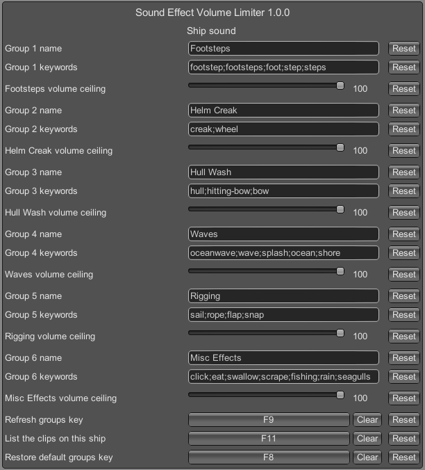

# Sound Effects Volume Limiter for Sailwind
Limit the maximum volume of groups of sound effects in Sailwind.

Requires [BepInEx Configuration Manager](https://github.com/BepInEx/BepInEx.ConfigurationManager)

  Developed in collaboration with [Dixie](https://github.com/AugSphere/BetterDrag) from the Sailwind community Discord who provided the original core code to cap sound effect volumes.

Is that creaky sound effect from the wheel ready to send you jumping overboard? Stormy wind or rain blowing our your eardrums? This plugin will allow you to adjust down the _maximum_ playback level of sound effects Sailwind, both while you're on a boat and while you are anywhere else in the game world.

## Features
This mod will limit, or cap, the volume of groups of specific sound effects in Sailwind. The user can control the maximum possible sound effect level down below it's default value. However, sound effects that are already quiet will stay quiet - so long as they don't go past the set volume cap for that group of sound effects.

There are six default sound effect groups shown in the screenshot above. Each group has a set of keywords to find and match sound effect clip names to a volume cap group. You can add or delete keywords and rename the categories: see the _Advanced Users_ section below.

Each sound effect group has a slider control ranging from 100% to 0%:
* At 100%, there is no cap set on the playback volume of any of the effects in that group - everything plays at its default loudness.
* At 0% all effects in that group are muted.
* Above 1% a cap is set on the maximum loudness any of the audio clips in that group can play.

Example: let's say that the default ship's wheel creaking sound effect has a playback level of 80% (0.8). If the "Helm Creak" slider is set to 40%, that sound effect cannot play any louder than 40%. But if there is another audio clip in that group that has a default volume of 20%, _it will not be lowered_. 

Depending on the sound effects in the grouping, you may need to reduce the maximum volume quite a lot to notice a difference.

User settings are saved in the BepInEx mod configuration file and will persist through saving and reloading.

There are assignable key bindings for additional features discussed in the Advanced Users section below.

### How it Works - Advanced Users
Sound effects in Sailwind have their playback volume determined in two ways. First, is the recorded volume of the sound clip itself and any adjustments made in Unity's audio mixer and audio effects - we can't change those. Second, is a playback volume scalar at runtime as part of the Unity audio engine - that's what this mod targets. 

The plugin searches for sound effect clip names on game load and then assigns them by keyword to a volume cap group. This should include any audio effects or files added by mods. The default volume cap groups and keywords do not capture every effect in game. The list assignment is dynamic and can be changed by the user to add or remove effect keywords or rename the control groups. Keywords are entered as a semicolon separated list.

Three key bindings are provided to manage the effects groups controls and sound effect keywords. These can be rebound to any standard keyboard input.
* F8 resets the keywords and groups to default.
* F9 refreshes the groups to the keywords currently listed. Use this after making any edits to the keywords or the group names.
* F11 outputs a list of all sound effect clip names to the BepInEx _player.log_ file. This will show
Because this plugin searches for all sound effects in the game - both those specific to each boat and the world scenes - there are multiple entries of the same sound clip name. The keyword search and group assignment module will pick up any and all effect clips matching the keyword search and should apply across entering multiple boats or across the entire game scene.

### Known Issues
* Setting the volume to the Footsteps group, or any group containing footstep sound effects, to 0% (muted) and then back to any limiter level above 1% may result in footstep effects not playing until the game is reloaded. This appears to be partially a vanilla game issue which contains bug(s) relating to how the footstep sound effects are played.

### Disclaimers
This plugin is provided as-is and may be used, shared or modified under the MIT License.

_Generative AI usage notice: this plugin was developed with the assistance of GPT-5.6-Luna._
